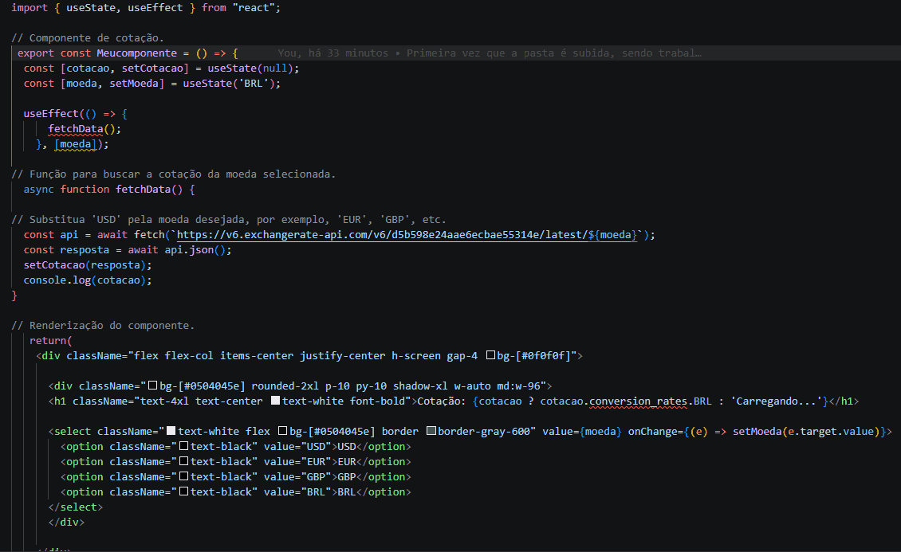
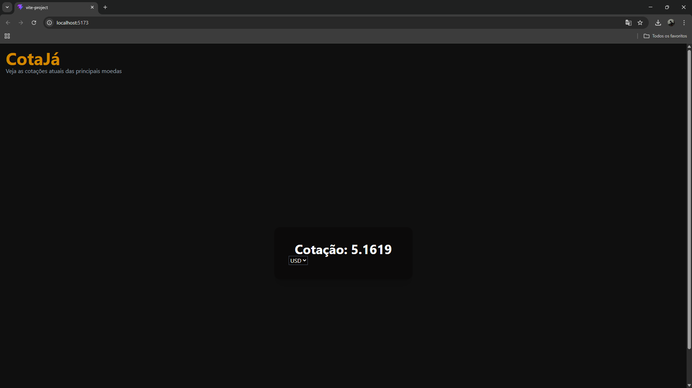

# Site-de-cotação
Site de cotação de moedas em tempo real, com comparador de câmbio. Feito com React, Typescript e Tailwind Css

# 💱 CotaJá

> Consulte cotações de moedas em tempo real, compare câmbios e visualize históricos — tudo em um só lugar.

<br />

<p align="center">
  
</p>

<br />

## 🚀 Funcionalidades

- 🔄 **Cotações em tempo real** — consulte o valor de diversas moedas com base em uma moeda de referência
- ⚖️ **Comparador de moedas** — compare duas moedas lado a lado
- 📈 **Histórico** — visualize a variação cambial ao longo do tempo *(em breve)*
- 🌙 **Tema escuro** — interface moderna com foco em legibilidade

<br />

## 🛠️ Tecnologias

| Tecnologia | Versão |
|---|---|
| [React](https://react.dev/) | ^19 |
| [TypeScript](https://www.typescriptlang.org/) | ^5 |
| [Vite](https://vitejs.dev/) | ^6 |
| [Tailwind CSS](https://tailwindcss.com/) | v4 |
| [ExchangeRate-API](https://www.exchangerate-api.com/) | Free Tier |

<br />

<p align="center">
  
</p>

<br />

## ⚙️ Como rodar localmente

```bash
# Clone o repositório
git clone https://github.com/seu-usuario/cotaja.git

# Entre na pasta do projeto
cd cotaja

# Instale as dependências
npm install

# Inicie o servidor de desenvolvimento
npm run dev
```

> O projeto estará disponível em `http://localhost:5173`

<br />

## 🔑 Variáveis de ambiente

Crie um arquivo `.env` na raiz do projeto com a seguinte variável:

```env
VITE_API_KEY=sua_chave_aqui
```

> Obtenha sua chave gratuita em [exchangerate-api.com](https://www.exchangerate-api.com/)

<br />

## 📦 Build para produção

```bash
npm run build
```

<br />

## 🗺️ Roadmap

- [x] Cotações em tempo real
- [x] Seleção dinâmica de moeda base
- [ ] Comparador de moedas
- [ ] Histórico de cotações
- [ ] Deploy na Vercel

<br />

## 📄 Licença

Este projeto está sob a licença MIT. Veja o arquivo [LICENSE](./LICENSE) para mais detalhes.

---

<p align="center">
  Feito por <a href="https://github.com/seu-usuario">Lazaro</a>
</p>
